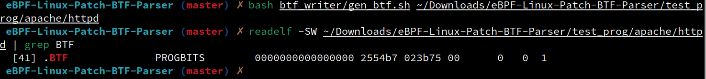
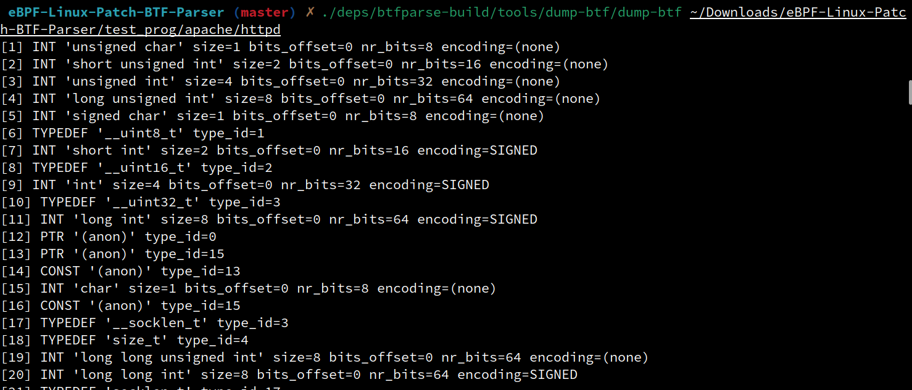
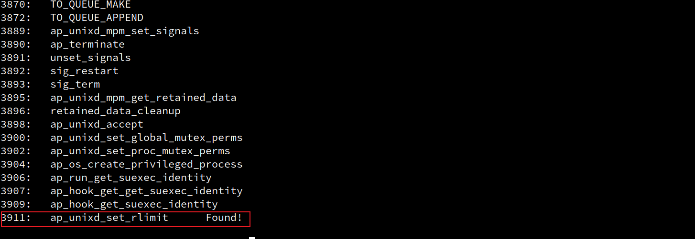
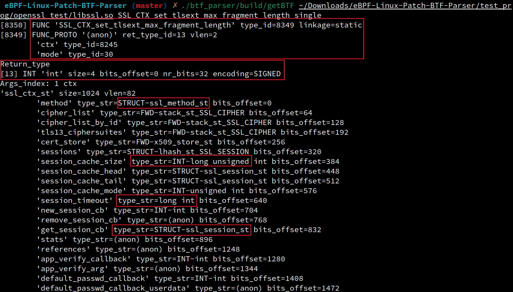
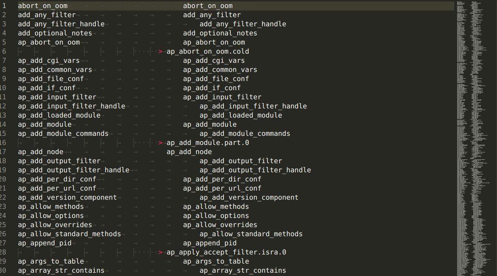

### 项目Build  
1. 安装依赖  
```
sudo apt install git vim clang cmake build-essential g++ git zlib1g-dev llvm python3 python3-pip iproute2 libelf-dev \
	 libdw-dev 
```

2. build  
```
bash scripts/build_all.sh  
# bash scripts/build_deps.sh，后面deps编译好  
```

### TODO  
1. (done)改动Cmake，确保bpfparser指出现一次  
2. 生成BTF，dump BTF结果，确保类型都正确  
3. 实现自己的BTF Parser，获取Patch必需的信息  

#### 用simple作为例子，验证正确性
1. 
```
bpftool -j btf dump file test_prog/01-simple_test/bin/simple
```


### NOTES 
1. 搭建开发环境，依赖于git, vim, clang, cmake, build-essential, g++, git, zlib1g-dev, llvm, python3, python3-pip, iproute2, libelf-dev等
```bash
bash scripts/build_all.sh
```

2. 为带有debug info的elf文件生成BTF section
```bash
bash btf_writer/gen_btf.sh file_with_debuginfo
```


3. 解析二进制中BTF section的内容
```bash
/deps/btfparse-build/tools/dump-btf/dump-btf file_with_btfsection
```


4. 得到某个函数的BTF信息，参数为elf路径和欲查找函数名(./btf_parser/build/getBTF elf_path func_name [single],  single 是可选参数)
- 不带single参数，打印BTF中的所有函数名，若找到输入中的函数，则会额外打印Found
	```bash
	./btf_parser/build/getBTF elf_path func_name
	```
	

- 带single参数，打印函数func_name的详细信息,例如
	

5. 比较nm -s输出的函数信息和btfparse库解析的是否相同
```bash
python btf_parser/check.py file_with_debuginfo
```

